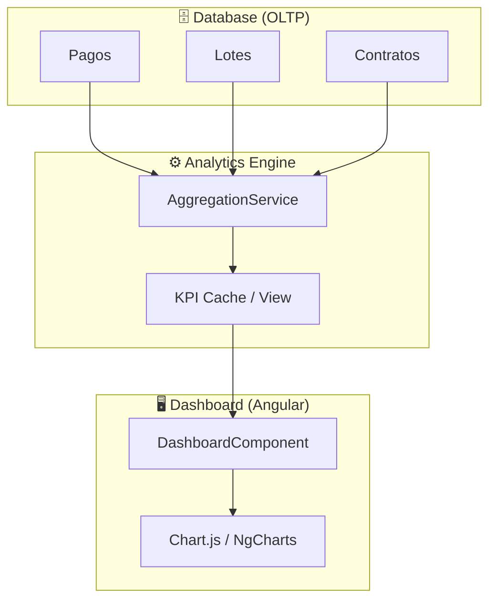

# 📊 Especificación Técnica: BI & Analytics (Dashboard)
> **Versión**: 1.0.4 | **Módulo**: BI & Estrategia | **Tipo**: ECU (Especificación de Componentes)

---

## 1. Arquitectura de Inteligencia de Negocio

El módulo de BI extrae, transforma y proyecta los datos transaccionales de CasaVida para ofrecer una visión de 360° del rendimiento empresarial.

---

## 2. Definición de KPIs Estratégicos

El éxito comercial se mide a través de cuatro indicadores críticos monitoreados en tiempo real:

| KPI | Definición de Negocio | Impacto en Decisión |
| :--- | :--- | :--- |
| **Ventas Totales** | Valor bruto de contratos firmados. | Ritmo de crecimiento de capital. |
| **Recaudación Real** | Efectivo neto validado en banco. | Liquidez inmediata (Cashflow). |
| **Cartera Vencida** | Suma de cuotas con retraso (+15 días). | Eficiencia del equipo de cobranza. |
| **Inventario Libre** | % de unidades disponibles por proyecto. | Estrategia de precios y preventa. |

---

## 3. Visualización Dinámica de Gráficos

El sistema implementa **Chart.js** para ofrecer una experiencia interactiva:
*   **Líneas de Tendencia**: Evolución de ventas mes a mes.
*   **Donas de Estatus**: Composición del inventario global.
*   **Barras de Desempeño**: Ranking comparativo de la fuerza de ventas.

> [!TIP]
> Todos los gráficos permiten el filtrado dinámico por **[Fraccionamiento]** o **[Rango de Fechas]**, recalculando las métricas en menos de 100ms.

---

## 4. Seguridad de la Información BI

> [!IMPORTANT]
> **Privacidad Segregada**: Los reportes BI ocultan por defecto los datos sensibles de los clientes (DLP - Data Loss Prevention), mostrando únicamente IDs y agregados financieros para proteger la base de datos comercial.
