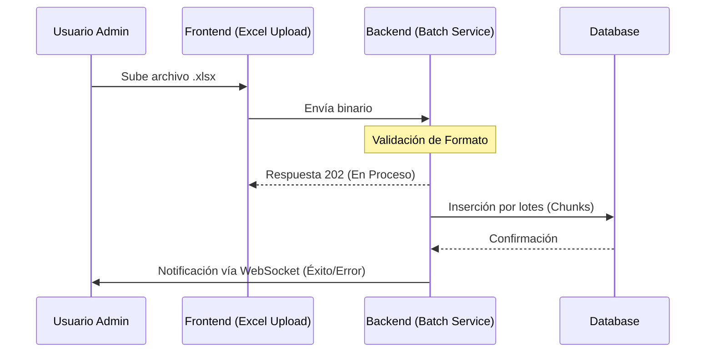

# 🚚 Especificación Técnica: Carga Masiva (Batch Processing)
> **Versión**: 1.0.4 | **Módulo**: Integración de Datos | **Tipo**: ECU (Especificación de Componentes)

---

## 1. Arquitectura de Procesamiento Batch

Para el manejo de grandes volúmenes de datos (Ej. +1000 lotes o +500 usuarios), el sistema utiliza una arquitectura asíncrona para no bloquear el hilo principal.

---

## 2. Reglas de Validación de Plantillas

Antes de persistir los datos, el motor de carga valida:

*   **Integridad de Referencia**: Que los fraccionamientos mencionados existan.
*   **Formato de Datos**: Que los precios sean numéricos y las fechas tengan formato ISO.
*   **Unicidad**: Que no existan IDs duplicados para la misma manzana y lote.

---

## 3. Gestión de Errores

Si la carga falla, el sistema genera un **Reporte de Errores** descargable en Excel donde se indica:
1. Fila del error.
2. Columna afectada.
3. Descripción del problema (Ej: "Monto no puede ser negativo").

---

## 4. Consideraciones de Rendimiento

> [!IMPORTANT]
> **Límites de Carga**: Se recomienda no exceder las 5,000 filas por archivo para mantener tiempos de respuesta óptimos. Para cargas mayores, favor de dividir el archivo en partes.
