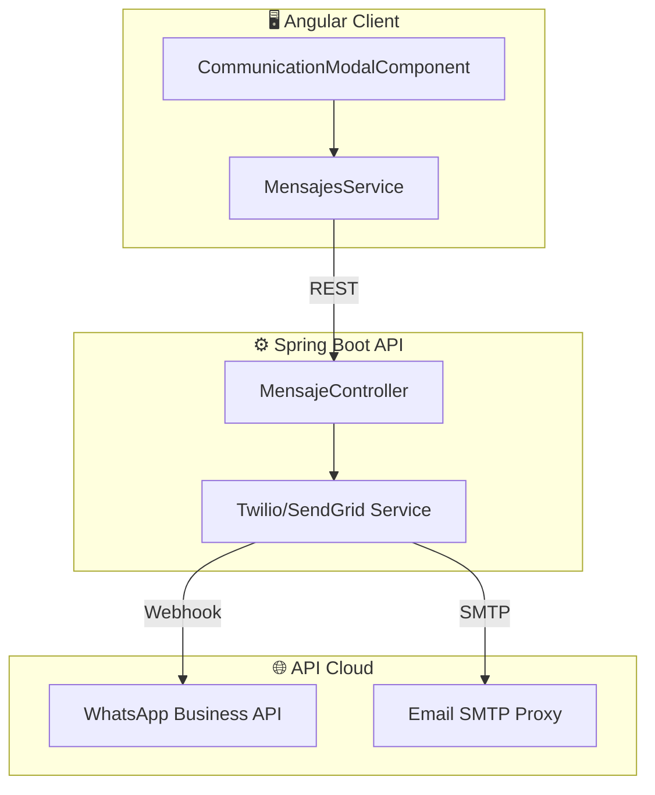

# 📡 Análisis de Tecnologías: Comunicación CRM
> **Versión**: 1.0.4 | **Módulo**: WhatsApp & Email | **Tipo**: ECU (Comunicación Externa)

---

## 1. Arquitectura de Mensajería Omnicanal

El módulo de comunicación actúa como puente entre los vendedores y el cliente final, registrando cada interacción de forma inmutable en el expediente del lead.

---

## 2. Estrategia de WhatsApp (Twilio)

Se ha seleccionado **Twilio WhatsApp API** por su robustez y facilidad de integración asíncrona mediante Webhooks.

### Beneficios del Proveedor:
*   **Entregabilidad**: Alta tasa de recepción de mensajes transaccionales.
*   **Tracking**: Confirmación de recepción y lectura en tiempo real.
*   **Escalabilidad**: Soporte para múltiples números y bots de respuesta rápida.

---

## 3. Estrategia de Email (SendGrid)

Para la comunicación formal y envío de contratos, se utiliza un relevo SMTP dedicado para evitar carpetas de SPAM.

> [!TIP]
> El sistema utiliza **Templates HTML Dinámicos** para que los correos luzcan profesionales en cualquier dispositivo móvil, incluyendo botones de acción directa para el cliente.

---

## 4. Registro y Auditoría

Cada mensaje (Enviado o Recibido) genera una entrada en el **[Historial de Eventos]** del cliente.

> [!IMPORTANT]
> **Consentimiento Digital**: El sistema valida automáticamente si el contacto ha aceptado recibir notificaciones antes de disparar campañas masivas de preventa.
