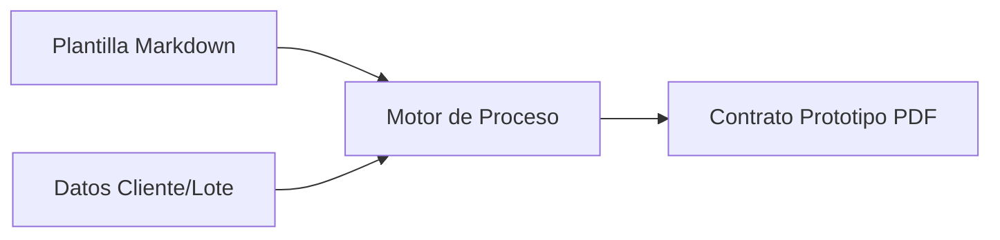

# 📑 Especificación Técnica: Contratación Legal Digital
> **Versión**: 1.0.4 | **Módulo**: Legal & Contratación | **Tipo**: ECU (Especificación de Componentes)

---

## 1. Motor de Generación de Archivos

El sistema automatiza la creación de contratos legales inyectando datos del cliente y del lote en plantillas pre-definidas.

---

## 2. Firma Digital (Flujo de Próxima Implementación)

> [!WARNING]
> **Estado Actual**: Este sub-módulo se encuentra **PENDIENTE POR DESARROLLAR**. La firma actual debe realizarse de manera autógrafa sobre la impresión del documento.

### Roadmap de Firma:
1. **Tokenización**: Generación de un hash único por contrato.
2. **Validación**: Registro de IP, fecha y hora de la aceptación.
3. **Persistencia**: Almacenamiento del contrato firmado con certificado digital.

---

## 3. Seguridad del Documento

*   **Marca de Agua**: Los borradores de contrato incluyen la leyenda "NO VÁLIDO - BORRADOR".
*   **Folio Único**: Cada contrato generado recibe un ID secuencial inalterable.

---

## 4. Recomendaciones Legales

> [!IMPORTANT]
> Se debe asegurar que las cláusulas de rescisión de contrato estén debidamente actualizadas en la "Plantilla Maestra" antes de realizar una nueva carga masiva de ventas.
