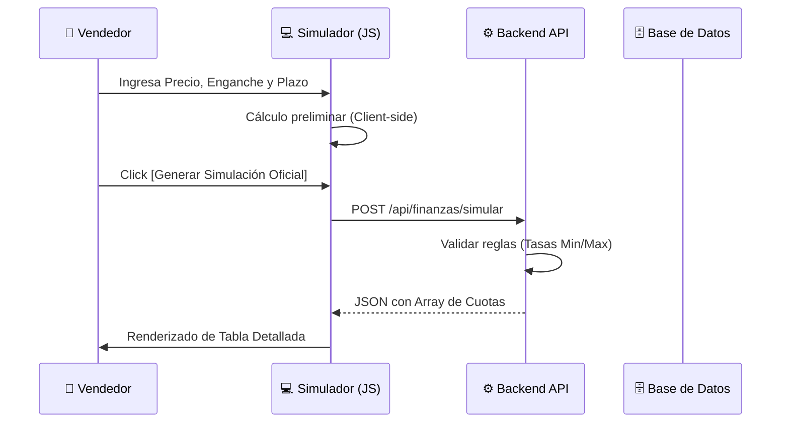

# 💰 Especificación Técnica: Finanzas & Simulación
> **Versión**: 1.0.4 | **Módulo**: Cálculos Financieros | **Tipo**: ECU (Especificación de Componentes)

---

## 1. El Motor de Simulación (Cálculo Francés)

El simulador es el corazón del motor de ventas de CasaVida, permitiendo proyectar planes de pago personalizados basados en el **Sistemas de Amortización Francés** (cuotas constantes).

### Fórmula de Referencia:
$$ Cuota = P \times \frac{i(1+i)^n}{(1+i)^n - 1} $$

> [!NOTE]
> El sistema calcula automáticamente la porción de **Interés** y **Capital** de cada cuota, actualizando el saldo insoluto en tiempo real durante la simulación.

---

## 2. Flujo de Generación de Tabla de Amortización

---

## 3. Integración con el Expediente del Cliente

Una vez que la simulación es aceptada por el cliente:
1.  Se genera un **ID de Simulación** único.
2.  Este ID vincula el contrato legal con el plan de pagos real.
3.  Cualquier abono validado por Contabilidad impacta directamente sobre la cuota correspondiente.

> [!IMPORTANT]
> **Consistencia Financiera**: El sistema impide la modificación manual de las cuotas una vez que el contrato ha sido firmado digitalmente o físicamente posteado. Cualquier ajuste requiere un ticket de auditoría.

---

## 4. Reportes de Cobranza (BI)

El motor financiero provee datos agregados para:
*   **Proyección de Cashflow**: Ingresos esperados por mes.
*   **Métrica de Morosidad**: Identificación automática de cuotas vencidas.
