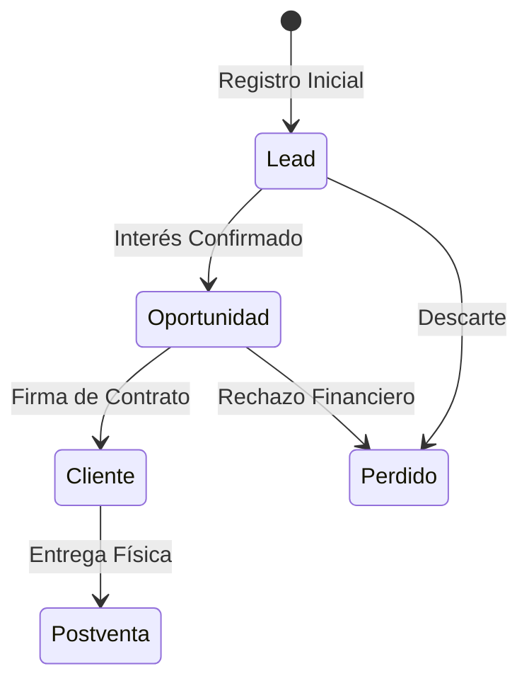
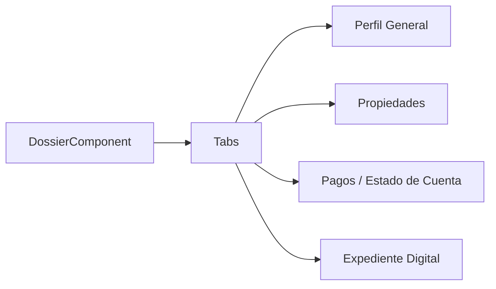

# 👥 Especificación Técnica: Gestión de Clientes Avanzada
> **Versión**: 1.0.4 | **Módulo**: CRM & Dossier | **Tipo**: ECU (Especificación de Componentes)

---

## 1. Flujo de Conversión (Lead to Client)

La trazabilidad es el motor del CRM. El sistema asegura que ningún contacto se pierda en el proceso comercial.

### 1.1 El Concepto de "Dossier Digital"
El Dossier es el corazón de la información del cliente. Integra de forma dinámica:
- **KYC (Know Your Customer)**: Identificaciones y documentos validados.
- **Inventario**: Relación histórica de lotes adquiridos.
- **Libro de Pagos**: Historial de abonos, saldos y cronograma de pagos.

---

## 2. Arquitectura de Navegación del Dossier

El componente utiliza un patrón de **Navegación por Pestañas** para mantener la densidad de información controlada.

---

## 3. Seguridad y Privacidad (RBAC)

Dada la sensibilidad de los datos fiscales y personales, el acceso está blindado por roles:

| Rol | Alcance de Visualización |
| :--- | :--- |
| **Vendedor** | Solo clientes asignados a su cartera comercial. |
| **Recepción** | Visualización de saldos y carga de comprobantes. |
| **Contabilidad** | Acceso a documentos fiscales y validación de RFC. |
| **Admin** | Acceso total y capacidad de reasignación de cartera. |

---

## 4. Auditoría de Datos Críticos

Cada modificación en campos sensibles (Ej: Teléfono, Email o Precio Final) genera un registro de auditoría inmutable en el sistema.

> [!IMPORTANT]
> **Integridad de Datos**: Cualquier cambio en el precio de un contrato después de ser firmado requiere una "Nota de Crédito" o autorización del nivel Directivo en el sistema.

---

## 5. Recomendaciones de Infraestructura

> [!TIP]
> Se recomienda el almacenamiento de documentos (Dossier) en un servicio de **Cloud Storage (S3 / Azure Blobs)** en lugar de la base de datos, para asegurar la escalabilidad y rapidez de carga del sistema.
