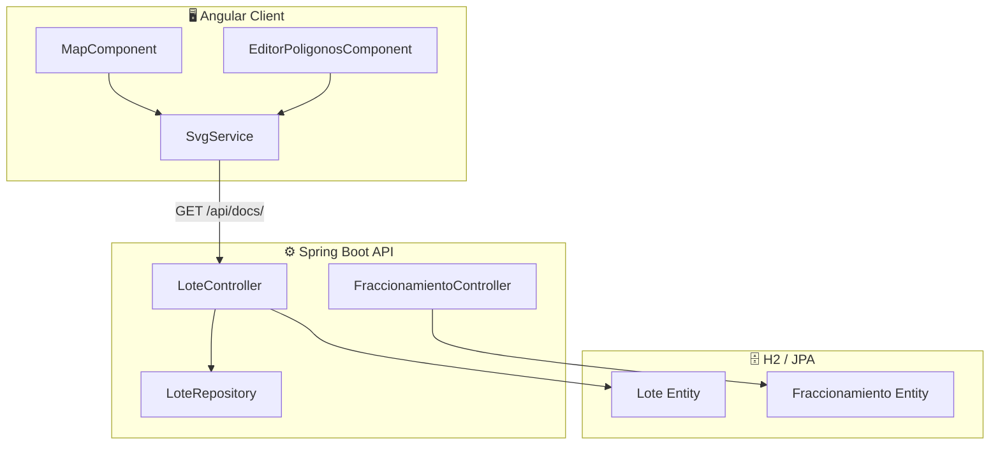
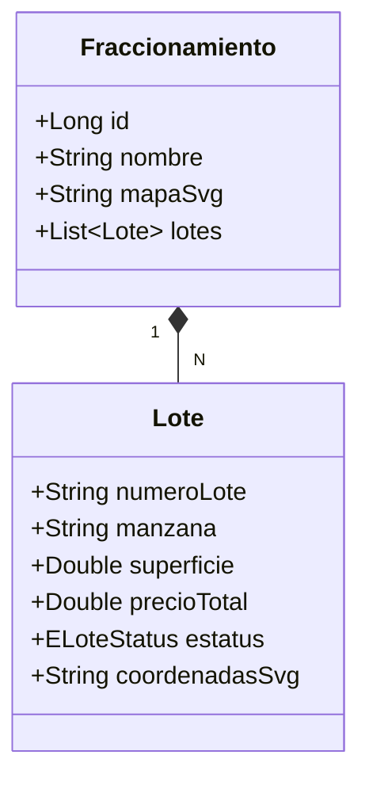

# 🏗️ Especificación Técnica: Inventario & Fraccionamientos
> **Versión**: 1.0.4 | **Módulo**: Inventario Geográfico | **Tipo**: ECU (Especificación de Componentes)

---

## 1. Arquitectura de Visualización (SVG Maps)

El sistema utiliza un motor de renderizado basado en **SVG dinámicos** para permitir la interacción visual con los lotes sin depender de pesadas imágenes de satélite.

> [!NOTE]
> Cada lote se representa por un elemento `<path>` o `<polygon>` en el XML del mapa. El sistema vincula el atributo `id` del SVG con el número de lote almacenado en la persistencia.

---

## 2. Modelo de Datos de Inventario

La relación fundamental para el motor de ventas es de **Uno a Muchos** entre Proyectos y Unidades.

---

## 3. Ciclo de Vida del Estatus del Lote

El motor de negocio de CasaVida restringe las acciones comerciales basadas en el siguiente esquema de estados:

| Estado | Significado EIU | Acción Permitida |
| :--- | :--- | :--- |
| **DISPONIBLE** | 🟢 Libre para venta | Cotización, Simulación y Apartado |
| **APARTADO** | 🟡 Compromiso temporal | Recepción de Enganche (Bloqueado) |
| **VENDIDO** | 🔴 Propiedad asignada | Solo visualización de Dossier |

---

## 4. Consideraciones de Implementación

> [!IMPORTANT]
> **Optimización del DOM**: Para desarrollos con más de 500 lotes, se utiliza `ChangeDetectionStrategy.OnPush` para evitar el re-renderizado costoso de todo el SVG al seleccionar una sola unidad.
