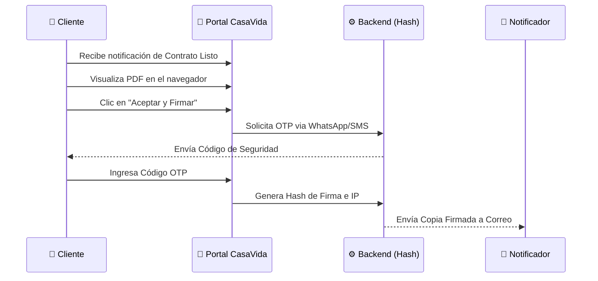

# 📜 Visión de Experiencia: Firma Digital de Clientes
> **Versión**: 1.0.4 | **Módulo**: Legal Tech | **Tipo**: EIU (Experiencia de Usuario)

---

## 1. Concepto de Validez Jurídica Digital

La Firma Digital permite agilizar el proceso de cierre de ventas eliminando la necesidad de traslados físicos para la firma de contratos de compra-venta.

> [!WARNING]
> **Estado de Desarrollo**: Esta funcionalidad se encuentra actualmente **PENDIENTE POR DESARROLLAR**. Las especificaciones a continuación representan el diseño objetivo para la Fase 3 del ERP.

---

## 2. Flujo de Experiencia del Cliente (Firma)

---

## 3. Elementos de Seguridad Previstos

*   **Hashing SHA-256**: Cada documento llevará una huella digital única.
*   **Estampado de Tiempo (Time-stamping)**: Certificación de la fecha y hora exacta de la firma.
*   **Log de Auditoría**: Registro de la dirección IP y dispositivo desde el cual se realizó la firma.

---

## 4. Interfaz de Usuario (EIU)

*   **Visor de PDF**: Integrado en el Portal del Cliente con controles de zoom.
*   **Panel de Aceptación**: Checkbox de "He leído y aceptado los términos" y botón de **[Firmar Mi Contrato]**.

> [!NOTE]
> El sistema garantizará que el cliente haya navegado hasta el final del documento antes de habilitar el botón de firma.
