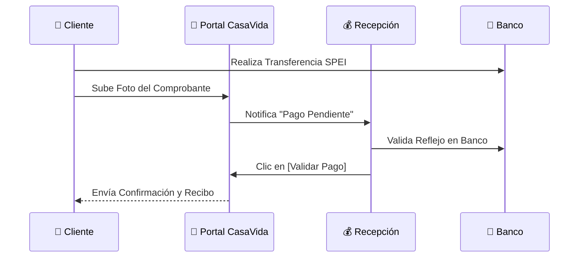

# 💳 Visión de Experiencia: Portal de Pagos
> **Versión**: 1.0.4 | **Módulo**: Gestión de Clientes | **Tipo**: EIU (Experiencia de Usuario)

---

## 1. Empoderamiento del Cliente

El Portal de Pagos permite que el cliente sea autosuficiente en la gestión de su deuda, reduciendo la carga operativa del equipo de Recepción.

### Funcionalidades Clave:
*   **Visor de Saldo**: Consulta de capital pagado y mensualidades pendientes.
*   **Carga de Comprobantes**: Botón **[Subir Comprobante]** para notificar transferencias bancarias.
*   **Notificaciones**: Alertas automáticas 3 días antes de cada vencimiento.

---

## 2. Flujo de Notificación de Pago

---

## 3. Diseño Visual y Accesibilidad

*   **Mobile First**: La interfaz está optimizada para ser consultada desde smartphones.
*   **Estatus Visual de Cuotas**:
    *   ✅ **Verde**: Pagada a tiempo.
    *   🕒 **Gris**: Pendiente de vencer.
    *   ⚠️ **Naranja**: Próxima a vencer (3 días).
    *   ❌ **Rojo**: Vencida / Moratoria.

---

## 4. Seguridad de Transacciones

> [!IMPORTANT]
> El portal no almacena datos de tarjetas de crédito. Toda transacción se realiza mediante referencias bancarias únicas para asegurar la máxima protección de los datos financieros del cliente.
